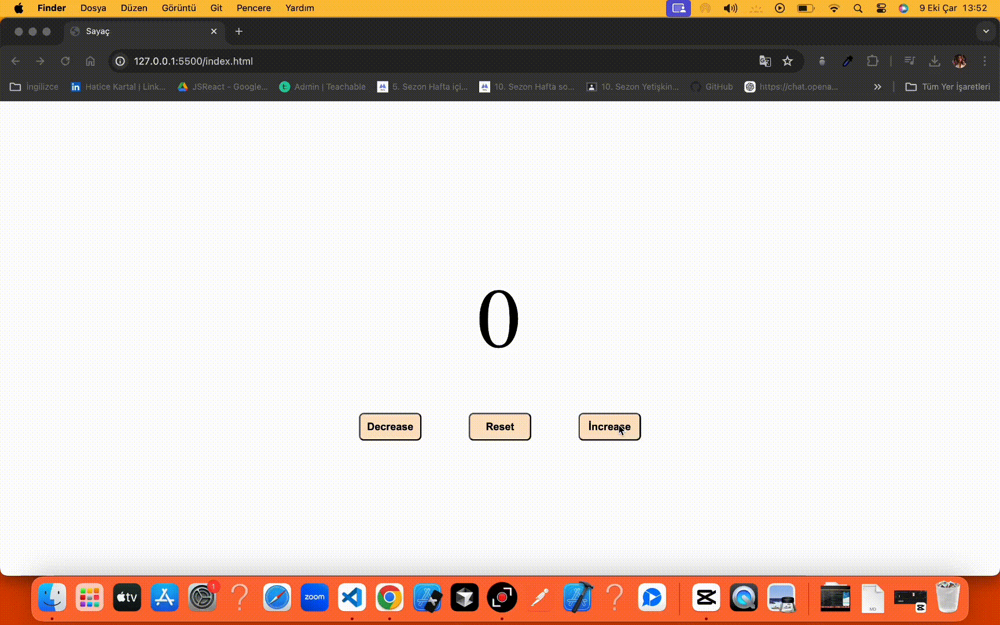

# Basit Sayaç 
Bu proje, HTML, CSS ve JavaScript kullanılarak geliştirilmiş bir sayaç uygulamasıdır. Kullanıcılar bu sayaç ile sayacı artırabilir, azaltabilir ve sıfırlayabilirler.

# Teknolojiler
- HTML
- CSS
- JavaScript

# GIF

